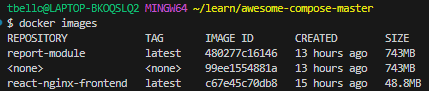

# Azure Container 

Container technology is growing popularly among developers these days and we wonder why. Containerization of software application allows building and deloying mordern applicaiton that  is scalable

According to Microsoft a container is a standard package of software that bundles an application'c code together with the related configuration files and libraries, and with the dependencies required for the app to run. This allows developers and IT pros to deploy applications seamlessly across environements.

## Advantages of Containerization
- Solve configurations error and delpoyment error that arizes from changing your software configuration or environment. A software applicaition, its dependencies, its os and its configuration are packaged together.

## Walkthrough of Deploying a Containerized Web Server on Azure Registry
1. Download a sample react application code base with docker file from [here](https://docs.docker.com/samples/react/). I downloaded the react-nginx project


2. Bulid and Run the docker image with the command below utilizing docker compose 
    ```
    docker compose up -d
    ```

3. Go to http://localhost to test the application. Take note of the port mapping. 

 
4. You can stop the container with the command 
    ```
    docker container stop <container_id>
    ```
5. Then remove the container with the command 
    ```
    docker container rm <container_id>
    ```
5. List the images using the command 
    ```
        docker images 
    ```


6. Now you can go to the Azure portal. Create a resource group.
7. Search for Container Registry. Create a container registry. I created a container registry called azcontainer7
8. In your local machine, login to azure portal using the command 

```
    az login
```
9. Login to the azure container registry 

```

az acr login --name <name-of-registry>
```

10. Tag the local image with the registy url and repository name using the command below

```
docker tag <image-name> <registry-url>/<repository-name>
```

11. Push the image to the repository using the command 

```
 docker push <registry-url>/<repository-name>
```

12. Below is an image of the commands I ran to push to the container registry


13.